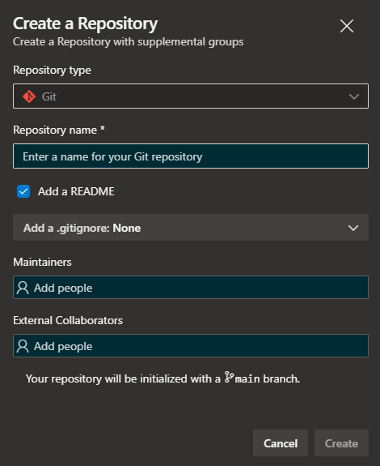

# Azure DevOps Advanced Repository Creation


[](https://github.com/JasonWhall/azure-devops-advanced-repository-creation/actions/workflows/build.yaml)

🚧 - Under Construction

An Azure DevOps Extension to Create a Repository with supplemental groups for maintainers and external collaborators.



## Getting Started

Before we can build the extension we need to install it's dependencies using the command below:

```bash
npm install
```

We can then run the extension in `development` mode by running:

```bash
npm run dev
```

This will start a [webpack dev server](https://webpack.js.org/configuration/dev-server/) so you can work with the Panel component locally. You can do this by visiting https://localhost:3000/dist/Panel/Panel.html

## Publishing

### Development

### Production
