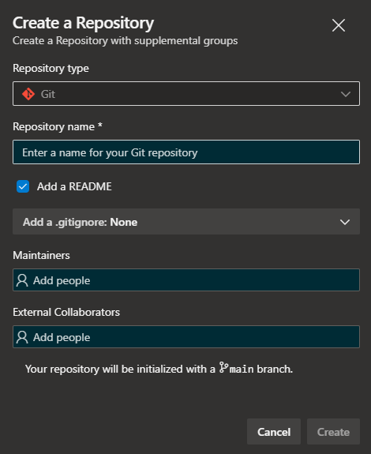
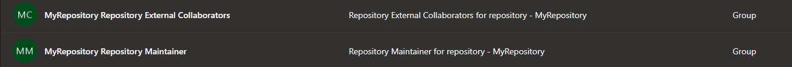

# Advanced Repository Creator

Option to create a repo with supplemental groups for maintainers and external collaborators to enforce good practice on repos

## What does it do?

- Create a Repository, with a similar experience to the normal repository creator.

- Create a group called `<Repository Name> Maintainers` that are determined to maintain the repository

- Create a group called `<Repository Name> External Collaborators` that are outside collaborators for the repository

- Assigns the chosen users to the Maintainer or Collaborator group.

- Assigns the groups the correct [permissions](#group-permissions) over the repository

## Usage Permissions

To use this extension, the repository creator requires the following permissions

- Create repository
- Create project-scoped Groups
- Manage Group Membership
- Manage Repository Permissions

## Group Permissions

By default a set of permissions are assigned to the groups created. These can be modified after creation as needed but below describe the default permissions assigned.

### Maintainers Group

- Administer
- Force push (rewrite history, delete branches and tags)
- Create branch
- Create tags
- Manage notes
- Bypass policies when pushing
- Rename repository
- Edit policies
- Remove others' locks
- Manage permissions
- Contribute to pull requests
- Bypass policies when completing pull requests

### External Collaborators Group

- Contribute
- Create branch
- Contribute to pull requests
